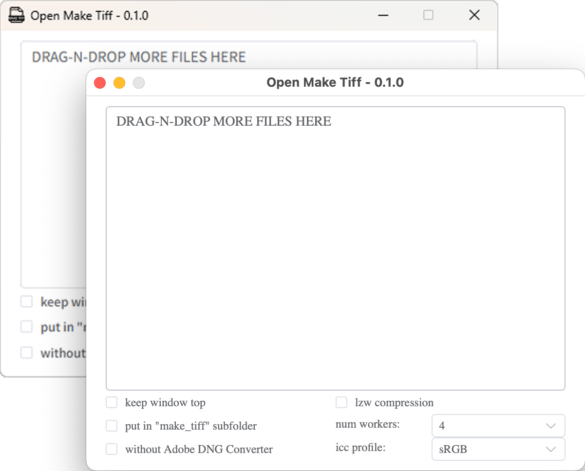

[English](./README.md) | 简体中文

# Open Make TIFF

## 关于

Open Make TIFF 是 [MakeTiff](https://www.colorperfect.com/MakeTiff/) 的免费开源替代品。它将 RAW 相机图像转换为线性 TIFF 文件，不做任何隐藏的色彩调整。

## 为什么需要线性 TIFF？

大多数 RAW 转换器会应用隐藏的色彩调整来"改善"图像。对于需要完全控制色彩处理流程的专业工作流，你需要真正未经处理的数据：

- **线性 gamma** - 保留原始传感器响应
- **无色彩处理** - 不应用白平衡、色彩矩阵、色调曲线

这让你能够从头开始自由地应用自己的色彩工作流。

## 功能特性

- **拖拽操作** - 直接将 RAW 文件拖放到窗口
- **多线程处理** - 可配置线程数的并行转换
- **内置 ICC Profile** - 包含 6 种 RGB 工作空间
- **LZW 压缩** - 可选无损压缩
- **子文件夹输出** - 输出到 `make_tiff` 子文件夹
- **窗口置顶** - 保持窗口在其他应用程序之上
- **跨平台** - 支持 macOS 和 Windows

## 工作原理

Open Make TIFF 使用三个工具的组合：

1. **Adobe DNG Converter** - 识别相机型号、执行拜耳插值、解码白平衡信息
2. **Libraw (dcraw_emu)** - 从 DNG 文件生成线性 TIFF
3. **ExifTool** - 复制原始 EXIF 元数据并嵌入 ICC Profile

## 系统要求

- macOS 或 Windows
- [Adobe DNG Converter](https://helpx.adobe.com/camera-raw/using/adobe-dng-converter.html)（可选，但推荐安装以获得最佳相机支持）

## 安装

从 [Releases](../../releases) 页面下载最新版本。

## 使用方法

1. 启动 Open Make TIFF
2. 将 RAW 文件拖放到窗口
3. 根据需要配置选项：
   - **线程数**：并行转换的线程数量
   - **ICC Profile**：要嵌入的 RGB 工作空间
   - **压缩**：启用 LZW 压缩
   - **子文件夹**：输出到 `make_tiff` 子文件夹
   - **窗口置顶**：保持窗口在其他应用之上
   - **禁用 DNG Converter**：直接使用 Libraw（适用于 Adobe 不支持的相机）

## 支持的 ICC Profile

| Profile | 描述 |
|---------|------|
| sRGB | 标准 RGB 色彩空间 |
| Adobe RGB 1998 | 广色域色彩空间 |
| Display P3 | Apple Display P3 |
| ProPhoto | 超广色域色彩空间 |
| BT.2020 | Rec. 2020 UHDTV 色彩空间 |
| Hasselblad RGB | 哈苏原生色彩空间 |

## 支持的 RAW 格式

常见 RAW 格式包括：
- Canon (.cr2, .cr3)
- Nikon (.nef)
- Sony (.arw)
- Fujifilm (.raf)
- Hasselblad (.fff, .3fr)
- 更多...

## 许可证

[GPL-3.0](./LICENSE)
